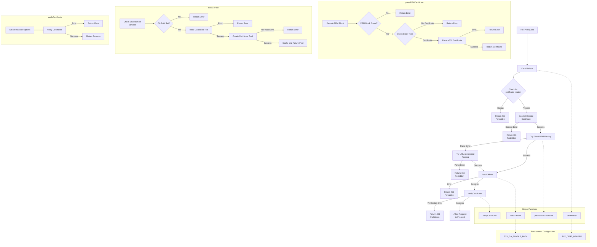

# custom-mtls
Reference Go Plugin performing pseudo mTLS validation for use case where SSL is terminated at an NLB.


# Get Started
### 1. Create a Root CA (Private Key + Self-Signed Certificate)
   ##### Generate a Root CA private key    
    openssl genrsa -out rootCA.key 4096
    
##### Create a self-signed Root CA Certificate  
    openssl req -x509 -new -nodes -key rootCA.key -sha256 -days 3650 \
        -out rootCA.pem \
        -subj "/C=US/ST=<state>/L=<city>/O=<org-name>/CN=MyRootCA"

### 2. Generate a Client Certificate Signed by the Root CA

##### Generate a client private key
    openssl genrsa -out client.key 2048
##### Generate a certificate signing request (CSR)
    openssl req -new -key client.key \
    -out client.csr \
    -subj "/C=US/ST=<state>/L=<city>/O=<orgn-name>/CN=Client1"
##### Sign the CSR with your root CA
    openssl x509 -req -in client.csr \
      -CA rootCA.pem -CAkey rootCA.key \
      -CAcreateserial \
      -out client.crt \
      -days 365 -sha256


### 3. Gateway Setup
* Mount your Root CA onto the file system of the Gateway
* Configure the TYK_CA_BUNDLE_PATH environment variable with the path to the Root CA certificate
* Mount the compiled plugin onto the file system of the Gateway

### 4. Dashboard Setup
* Import the included API Definition
* Edit the API as need to point to the appropriate location of the plugin on the Gateway's file system

### 5. Client Setup
* Base64 encode the client certificate
* Make a request to the API including the base64 encoded certificate in the X-Client-Cert header

##### Example Curl
``` bash
curl -k --location 'https://localhost:8080/<listen-path>/get' --header 'X-Client-Cert: MIIEejCCAmKgAwIBAgIUZHgh/I8MEa2UObkRsCtCXhDPPK4wDQYJKoZIhvcNAQELBQAwVjELMAkGA1UEBhMCVVMxEDAOBgNVBAgMB0dlb3JnaWExEDAOBgNVBAcMB0F0bGFudGExDzANBgNVBAoMBlR5ay1DQTESMBAGA1UEAwwJVHlrUm9vdENBMB4XDTI2MDIyMzE1MTQxNVoXDTI3MDIyMzE1MTQxNVowVDELMAkGA1UEBhMCVVMxEDAOBgNVBAgMB0dlb3JnaWExEDAOBgNVBAcMB0F0bGFudGExDzANBgNVBAoMBlR5ay1DQTEQMA4GA1UEAwwHQ2xpZW50MTCCASIwDQYJKoZIhvcNAQEBBQADggEPADCCAQoCggEBAM97hzZte+Vnok36EI0cuY4yDfwUdGTyDOBvAKMDIfgaAbkY90kWwST3CE/97MzpDYJcdzjpkHaxViQwnvTau2ZzoDbnAzZW9f4Q9uJpeo8f7gpB6RLGDMPvJ8hZsV8MN1hyQ1zKm6gc93AkKSruxdQthtrJVsJECWwuVQhUlJg4kTx0nZ02x/Xkvuwwy69r6UTDZHXBsGYEAJlZHHwLlhxPd9TuvXIksgK2e97dtj/yNIDaS7lPZMZX9gM6HupQ/Y2MA5DtDFpjBLckeaG+3YxCybmHA2SnjPda6Wz1pXL9UV5jHd3EscIKElTuJe7nFVmzw6vR4/9mafs0YkwyXHECAwEAAaNCMEAwHQYDVR0OBBYEFK36FNNROiycfL3RxRpYmen73fTEMB8GA1UdIwQYMBaAFHTyPFjx5EvHKBhO2lVDo0ToDd8jMA0GCSqGSIb3DQEBCwUAA4ICAQADrHczmwpUdyWjBKOx9NH7fk7IgdYm0W+FhXIWkl1KFmge98R/msrUWQFdFJsiTphpf5G5diSBaNnoaOxincMmglI5rIxTlc1B+/6J6XunnLyKgItNHLpDNl9Tn1t8ECMP1wyecYJ0pivBVi+yKFTMR7YB7tY1/T0wbWj5pTAhIGJXgHT5jPMwO9E3k53UMy791zh+XOUxWZ94Q9oI00CScTat2SqY7caWR2T+Un/eKqP4kU1Px3H2uera+krQqYX0zuwuuWYdM79pSWlwxArx/a8kyyFZXWiyv7ObWiKAvOoCabta6mfXvAEVWNJYyhg58uTmJJAF9d3VDnscAwAJfmY3e0jJI4a7o09GQls3tHVzs2C6vPKv2BPnBKZ2vD/Md1HU2jQHrUzySN4soupudfI2TrO0JoY4RgpA5/1eU5X94JTnbCrNtyf95VWiUXOKoc85esozBAeAYb0c90varyBZ6mgoUAJ5az1qICQL/Wdk9333naxJVargMntjffSZnf46WeshJKBNswrJxCO8PiL69lIZEmg8oIirKL+BtQBorFNvfXp+VYRJ/nRHYHbDsKTPFDrviMJ/G0wwD64PBM/5WmupqhuaaFe2eYJ2QI1dW4CWqpDDyk44rcDhGP6b4ulGlWF7vs7zkIYdHKTcsrr9wLe7ksApzdvrNQh8lg=='
```


# Certificate Validation Plugin Flow Diagram

The following diagram illustrates the request flow through the CertPlugin.



## Plugin Overview

This diagram shows the flow of an HTTP request through the CertPlugin, which validates client certificates passed in HTTP headers. The plugin is designed for deployments where TLS is terminated at a load balancer (e.g., AWS NLB) that forwards client certificates in headers.

### Key Components:

1. **CertValidator**: The main entry point that processes incoming HTTP requests
2. **Certificate Extraction**: Gets the certificate from the configured HTTP header
3. **Certificate Decoding**: Base64 decodes the certificate data
4. **Certificate Parsing**: Uses a two-step approach:
   - First attempts to parse the PEM-encoded certificate directly
   - If that fails, tries URL-unescaping the raw certificate before parsing (handles AWS NLB encoding)
5. **CA Pool Loading**: Loads and caches the trusted CA certificates
6. **Certificate Verification**: Validates the client certificate against the CA pool

### Configuration:

The plugin is configured via environment variables:
- **TYK_CA_BUNDLE_PATH**: Path to a PEM file with trusted CA certificates (required)
- **TYK_CERT_HEADER**: Header name containing the PEM-encoded client cert (default: X-Client-Cert)
